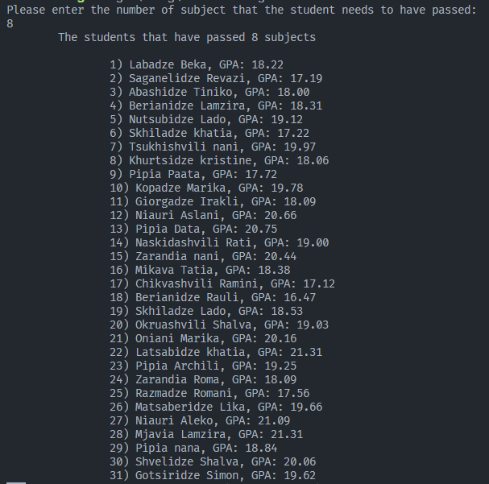

# დავალება 2

C++ -ზე დაწერილი კოდის გადაწერა Rust ენაზე.

main ფუნქციაში უზრუნველყავით:

1. 10 პროგრამისთვის მეხსიერების გამოყოფა (ობიექტის შექმნა).
2. პროგრამის მოცულობა განსაზღვრეთ შემთხვევითი პრინციპით;
3. ასევე შემთხვევითი პრინციპით მოახდინეთ 2 მათგანზე მონაცემების ბეჭდვა.
4. დაითვალეთ და დაბეჭდეთ ინფორმაცია მეხსიერების მოცულობაზე, რომელიც გამოყოფილია პროგრამებისთვის, მაგრამ არის აუთვისებელი (ბოლო ფურცლებზე არსებული თავისუფალი ბაიტების ჯამური რაოდენობა. შენიშვნა. სურვილის შემთხვევაში ეს მნიშვნელობა შეიძლება დაემატოს კლასს ატრიბუტის სახით).

## გაშვებისას მიღებული შედეგი

